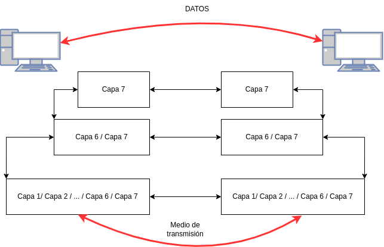
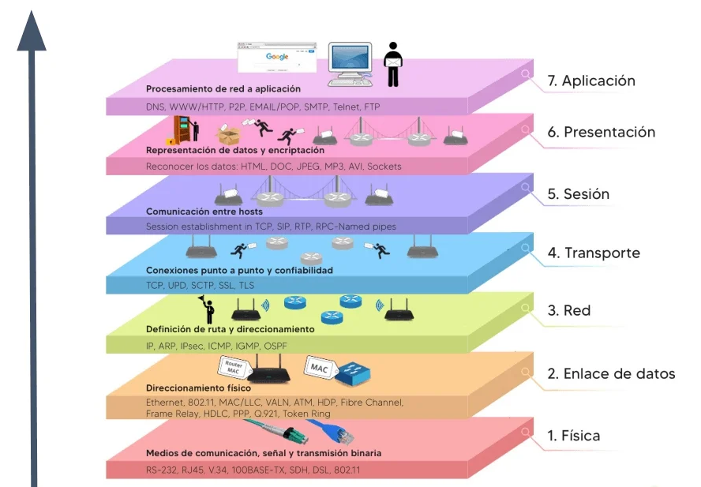
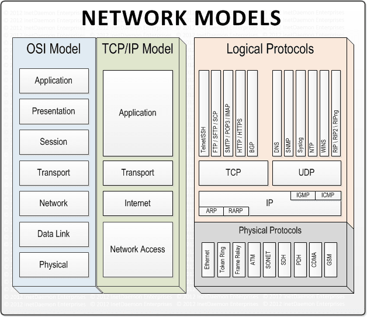
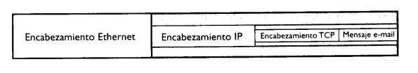
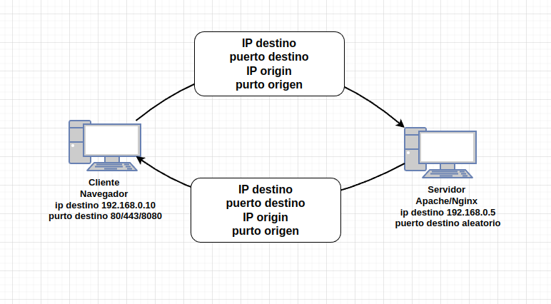

# **Unidad 02**
## Modelo OSI
##  Protocolos por capas
##  TCP/IP

---
# **Breve Introducción** (Trivial)
* Computadoras Conectadas -> Red
* Internet es una Red -> Computadoras Conectadas
* Medios de transmisión = [Cobre, Fibra, Radio]
* Necesidad de establecer protocolos.

---
# Modelos de conexión
* ### ~~Monolítico~~ -> Rígido  
* ### __Capas__ -> Flexible
# ?

---

# Modelo por Capas o OSI
---


---



---

# Modelo TCP/IP

---


---
<!-- theme: default
--->

# 1 Enlace
 La capa de enlace esta situada en la parte inferior de la pila. 
 Es la responsable de transmitir y recibir porciones de información (Frame). 
 - Ethernet
 - PPP (Point-to-Point Protocol, Protocolo punto a punto).

---

# 2 Internet  
 La capa de red se situada encima de la capa de enlace. 
 Es la responsable de encaminar y direccionar porciones de datos. 
 Para nuestro propósito, el principal protocolo de este nivel es IP (Internet Protocol, Protocolo Internet).
 Las porciones de información que se mueven en esta capa se llaman paquetes.

---

# 3 Transporte

 Esta por encima de la capa de red y es la que se asegura que los datos se dirijan o vengan de los procesos correspondientes.


---
# 7 Aplicación

Esta en parte superior de la pila y con frecuencia se implementa en aplicaciones de usuario como Telnet o Navegadores.
Los datos es esta capa son estructuras de datos como html o json.

---



---
# Python com Cliente/Servidor

## El modelo para programar comunicación entre procesos en redes se llama Socket y python tiene su api.

## El modelo se llama Cliente/Servidor

---


---
## Practica
En el repositorio de la unidad 2 hay dos programas, uno es un servidor y otro un cliente.
1. Entre dos grupos o computadora, unos ejecutaran el servidor y otros el cliente. Luego intercambiaran los roles.
3. Modificaran el programa servidor para determinar la cantidad de byte recibidos y le devolverán al cliente el número o la longitud recibida.
4. Devolverán los datos recibidos mas la longitud de estos.

---
# Trabajo Practico TCP/IP
## Conceptos sobre codificación de datos.

**UTF-8** es un formato de codificación de caracteres que se utiliza para representar los caracteres de cualquier idioma en el mundo utilizando una serie de bytes.

El acrónimo UTF significa **"Unicode Transformation Format"**, lo que se traduce al español como **"Formato de Transformación Unicode"**.

**Unicode** es un estándar de codificación de caracteres que se utiliza para representar todos los caracteres de escritura.

---

``` Python
>>> cadena = 'Hola'
>>> byte = cadena.encode(encoding='utf-8')
>>> print (byte)
b'Hola'
>>> type(byte)
<class 'bytes'>
>>> cadena_nueva = byte.decode('utf-8')
>>> type(cadena_nueva)
<class 'str'>
>>> print(cadena_nueva)
Hola
```

---

# Diccionarios 

Los diccionarios son una estructura de datos muy útil en Python que permiten almacenar pares de clave-valor. 

``` python
mi_diccionario = {'nombre': 'Juan', 'edad': 30, 'ciudad': 'Concordia'}
print(mi_diccionario['nombre']) # salida: 'Juan'
print(mi_diccionario['ciudad']) # salida: 'Juan'
mi_diccionario['edad'] = 26 # modificar valor existente
mi_diccionario['telefono'] = '123-456-7890' # agregar nueva clave-valor
print(mi_diccioario)
```

---

El objetivo de este trabajo práctico es enviar al servidor un diccionario en formato de bytes que contenga los datos de temperatura y humedad vacíos. Para ello, se debe crear un diccionario con la siguiente estructura:
```python
mi_diccionario = {"temperatura": "", "humedad": ""}
```
La información debe ser obtenida de la estación meteorológica de la facultad y recibir los datos y mostrarlos por ejemplo : La temperatura es 20 ºC y la humedad 70 %.

El objetivo de este trabajo es practicar la transmisión de datos en formato de bytes, la manipulación de diccionarios y el procesamiento de datos para su presentación en pantalla y lo practicado en las clases anteriores :+1:.

:fire:__Primer trabajo obligatorio a presentar__:fire:

---
## Casos a tener en cuenta:
##  El diccionario puede tener los dos datos,uno o ninguno. 
## Tener en cuenta que la estación actualiza la información cada 5 minutos.